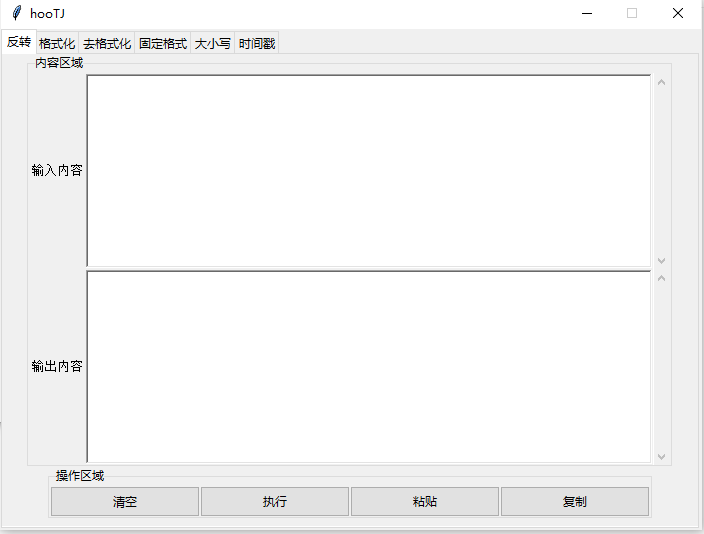
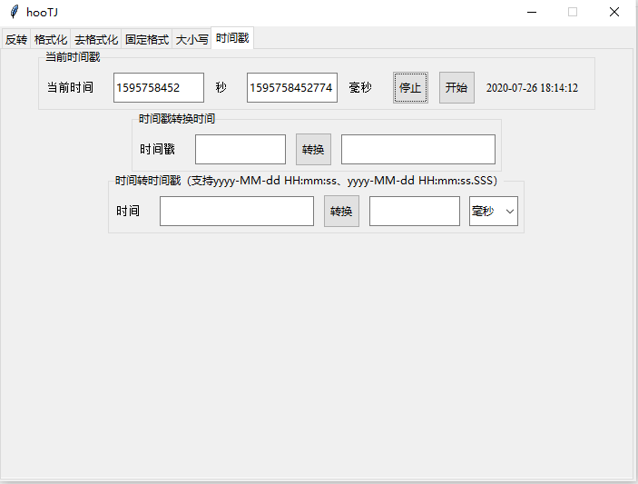

##### PY小工具

###### 功能
- 反转
- JSON格式化
- JSON去格式化
- EXCEL表转JSON
- 大小写转换
- 时间转换
- Base64
- 测试网速

###### 示例截图



###### 说明
```shell
## 依赖
# 提供安装速度需要增加-i https://pypi.tuna.tsinghua.edu.cn/simple/
pip install Pillow
pip install speedtest
pip install pyinstaller # 不使用虚拟环境，有时候会提示权限不足，则需要增加--user选项
## 打包
# 有时候需要指定path，会提示找不路径，则需要指定全路径
pyinstaller.exe -i icon.ico -n hooTJ -w -F main.py
```